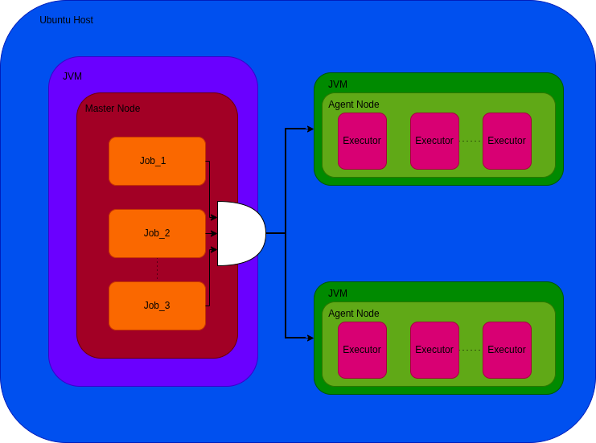
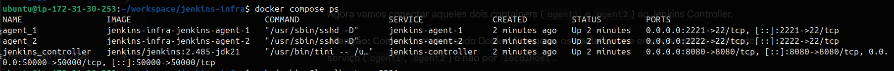
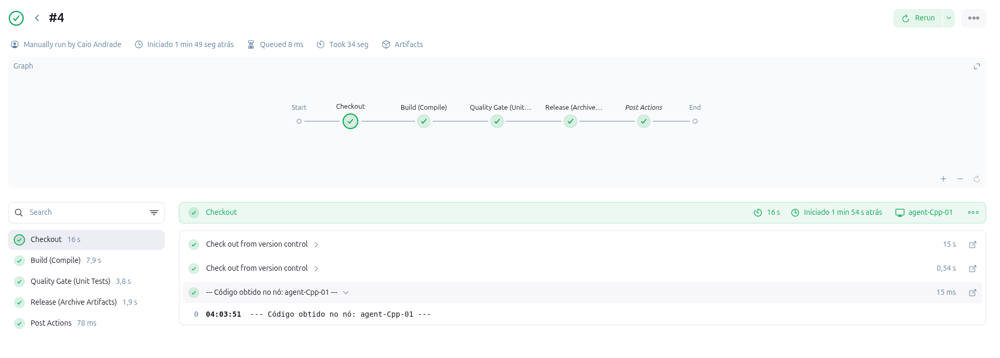
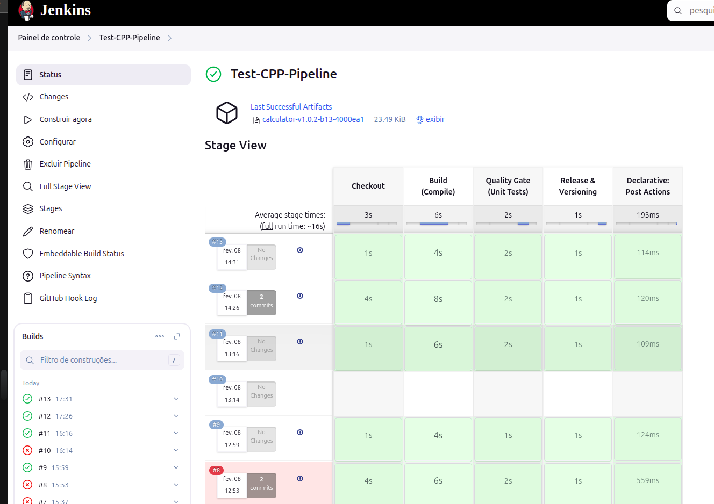
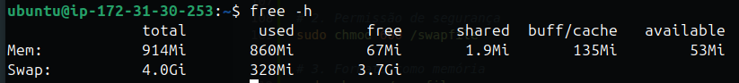

# Test_DevOps_4


Este projeto contém a definição de Infraestrutura como Código (IaC) para um ambiente de Integração Contínua (CI) baseado em Jenkins e Docker.

A arquitetura foi desenhada para garantir alta disponibilidade, isolamento de recursos e escalabilidade, utilizando o modelo Mestre-Escravo (Controller-Agent) para a compilação de aplicações C++17.

## Arquitetura da Solução

O ambiente é composto por um orquestrador (Jenkins Controller) e dois nós de execução efêmeros (Agents), conectados via rede interna Docker bridge.

* **Controller:** Responsável apenas pelo agendamento e gerenciamento de tarefas.
* **Agents:** Containers otimizados com ferramentas de compilação (CMake, Make, GCC) que realizam o trabalho pesado.




## Instalação e Execução da Infraestrutura

Para instanciar o ambiente completo, utilize o Docker Compose configurado no diretório de infraestrutura.

```bash
# 1. Acesse o diretório da infraestrutura
cd jenkins-infra

# 2. Suba a topologia em modo detached
docker compose up -d

# 3. Verifique se os containers estão saudáveis
docker ps
```



## Status dos Containers Ativos
### Configuração dos Nós de Execução (Agents)
A configuração no Jenkins foi realizada para garantir que nenhum build rode no Controller (Master). O Controller atua estritamente como orquestrador, delegando a carga de compilação C++ para os nós efêmeros.

* **Isolamento**: Cada etapa do pipeline roda em um container isolado.
* **Recursos**: O Controller tem limites de memória definidos para evitar OOM (Out of Memory), enquanto os Agentes possuem cotas separadas.


## Engenharia do Pipeline (Jenkinsfile)
O pipeline foi desenhado seguindo práticas modernas de CI/CD, priorizando imutabilidade, rastreabilidade e limpeza de recursos.

### Destaques da Implementação:
1. Gerenciamento de Espaço em Disco (cleanWs)
    * Adotada estratégia de limpeza agressiva. Utilizado bloco post { success { cleanWs() } } em cada estágio. Isso garante que, assim que um artefato é gerado e salvo, o workspace é limpo imediatamente, mantendo o servidor leve e evitando acúmulo de lixo de compilação.

2. Versionamento como Código (VERSION)
    * Versionamento pelo arquivo VERSION no repositório, e não um parâmetro manual no Jenkins. O pipeline lê este arquivo automaticamente, garantindo que o versionamento seja controlado via Git. Pensado como o paralelo do maven do java.

3. Persistência Entre Estágios (stash/unstash)
    * Como os agentes são efêmeros, utilizamos o stash para salvar os binários compilados no Controller temporariamente e o unstash para recuperá-los nos estágios de Teste e Release.

4. Agendamento (Cron)
    * Configurado com H H * * * para builds noturnos. O hash H permite que o Jenkins distribua a carga automaticamente.

### Evidências de Execução
Primeiro Pipeline com Sucesso:



**Visão de Estágios (Stage View)**: Optei pelo Stage View nativo para manter a instância leve, priorizando recursos de CPU/RAM para a compilação do C++ em vez de renderização de interfaces gráficas pesadas.




## Conectividade e Webhooks (Ngrok)

Para habilitar a Integração Contínua baseada em eventos (Push), foi configurado um Webhook no GitHub.

### Decisão de Arquitetura
Em vez de utilizar **Polling** (onde o Jenkins pergunta ao Git "tem novidade?" a cada minuto, desperdiçando recursos), optei por uma abordagem **Event-Driven**. Assim que um commit é realizado, o GitHub notifica o Jenkins imediatamente.

### Solução de Rede e Resiliência
Como o servidor não possui IP público fixo, utilizamos o **Ngrok** para criar um túnel seguro acessível externamente.

**Evolução da Implementação:**
Durante a configuração, identificamos um ponto de falha na execução manual via CLI: a conexão era encerrada ao fechar a sessão do terminal, e a URL pública mudava a cada reinicialização, quebrando a integração com o GitHub.

Para corrigir isso e garantir alta disponibilidade, o Ngrok foi configurado como um **Daemon do Sistema (Systemd Service)** associado a um domínio estático. Isso assegura que o túnel inicie automaticamente no boot do sistema e mantenha o mesmo endpoint permanentemente, independente de intervenção humana.

**Evidência do Serviço Ativo (Systemctl):**


## Relatório de Incidente e Otimização de Recursos
Durante a fase de testes de carga da topologia completa, foi identificado um gargalo crítico de recursos na instância de computação (Travamento de Kernel/OOM) ao iniciar simultaneamente as JVMs necessárias.

Para mitigar este risco e adequar a solução à capacidade do servidor, foram aplicadas as seguintes correções de engenharia:

1.  **Swap de Contenção:** Implementação de memória virtual em disco para estabilidade do SO.
2.  **Resource Quotas:** Aplicação de limites rígidos (Hard Limits) no Docker para impedir o travamento do Host.
3.  **JVM Tuning:** Configuração de Heap Size explicito nos arquivos de infraestrutura.

1. Swap de Contenção
Implementação de memória virtual em disco para estabilidade do SO.

```bash
# 1. Aloca 4GB de espaço em disco
sudo fallocate -l 4G /swapfile

# 2. Permissão de segurança
sudo chmod 600 /swapfile

# 3. Formata como memória
sudo mkswap /swapfile

# 4. Ativa o Swap imediatamente
sudo swapon /swapfile

# Garante que o Swap monte automaticamente no boot
echo '/swapfile none swap sw 0 0' | sudo tee -a /etc/fstab

# 6. Valida se a memória está ativa
free -h
```




2. Resource Quotas (Docker)
Aplicação de limites rígidos (Hard Limits) no Docker Compose para impedir o travamento do Host.

Snippet do docker-compose.yml:

```YAML
deploy:
  resources:
    limits:
      memory: 1G  # Reinicia se excede 1G
      cpus: '1.0'
environment:
  - JAVA_OPTS=-Xmx512m # Limita o consumo interno do Java
```


## Nota sobre o Código-Fonte (Mock Project)
O repositório original fornecido continha apenas um arquivo vazio (calculator). Para viabilizar a construção e validação do Pipeline de CI/CD conforme os requisitos (Compilação C++17 + Testes Unitários), foi gerada uma estrutura de projeto contendo:

1. CMakeLists.txt: Configuração de build definindo CMAKE_CXX_STANDARD 17.
2. src/main.cpp: Implementação de exemplo da calculadora.
3. tests/test_calc.cpp: Teste unitário simples para validação do Quality Gate no Jenkins.
4. VERSION: Arquivo de controle de versão semântica.

## Melhorias Futuras e Roadmap

Considerando este projeto como um MVP (Minimum Viable Product), as seguintes evoluções são sugeridas para um ambiente produtivo de larga escala:

1.  **Segurança e SSL:**
    * Implementação de um Reverse Proxy (Nginx/Traefik) à frente do Jenkins.
    * Configuração de certificados SSL (Let's Encrypt) para criptografia End-to-End, removendo a dependência do túnel HTTP simples.

2.  **Gestão de Artefatos (Binary Repository):**
    * Migração do armazenamento local (`archiveArtifacts`) para um gerenciador de repositório dedicado como **Sonatype Nexus** ou **JFrog Artifactory**. Isso permite versionamento real de binários, controle de retenção e cache de dependências.

3.  **Orquestração Dinâmica:**
    * Evolução dos Agentes Docker estáticos para **Kubernetes (Jenkins Kubernetes Plugin)**. Isso permitiria que os pods de build nascessem e morressem sob demanda (Elastic Build Agents), reduzindo o custo de infraestrutura ociosa.

4.  **Observabilidade:**
    * Integração com **Prometheus e Grafana** para monitorar métricas vitais (Tempo de build, Fila de espera, Uso de CPU/RAM dos nós) e gerar alertas de falha proativos.

5.  **Notificações:**
    * Integração do Pipeline com Slack, Microsoft Teams ou Discord para avisar o time instantaneamente sobre o status dos builds (`Success`/`Failure`).

6.  **Fluxo de Qualidade:**
    *  **Code Analysis:** O código C++ é analisado durante o build buscando por *Code Smells*, Bugs e Vulnerabilidades de segurança.
    *  **Quality Gate:** O pipeline possui um estágio de bloqueio. Se o código não atingir os critérios definidos (ex: 0 bugs críticos, cobertura mínima), o Jenkins falha o build imediatamente, impedindo a geração do artefato final.


## Referências e Documentação Técnica

As seguintes fontes foram consultadas para garantir a aderência às melhores práticas de mercado:

* **Jenkins Pipeline Syntax:** https://www.jenkins.io/doc/book/pipeline/syntax/
* **Docker & Docker Compose:** https://docs.docker.com/compose/
* **CMake Documentation:** https://cmake.org/cmake/help/latest/
* **Jenkins Workspace Cleanup:** https://plugins.jenkins.io/ws-cleanup/
* **Ngrok Documentation:** https://medium.com/@arifcse21/launching-ngrok-agent-tunnels-automatically-with-systemd-on-boot-8a527a7eb968